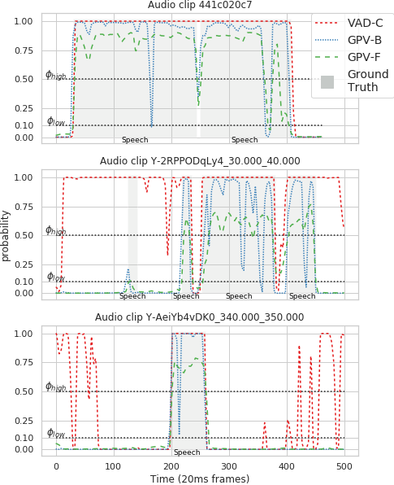

# Voice activity detection in the wild via weakly supervised sound event detection

This repository contains the evaluation script as well as the pretrained models from our Interspeech2020 paper [Voice activity detection in the wild via weakly supervised sound event detection](https://arxiv.org/abs/2003.12222).

The aim of our approach is to provide general-purpose VAD models (GPVAD), which are noise-robust in real-world scearios and not only in synthetic noise scenarios.





## Results (from the paper)

| Data  | Model | F1-macro  | F1-micro  | AUC       | FER       | Event-F1 |
|-------|-------|-----------|-----------|-----------|-----------|----------|
| Clean | VAD-C | **96.55** | **97.43** | **99.78** | **2.57**  | **78.9** |
| Clean | GPV-B | 86.24     | 88.41     | 96.55     | 11.59     | 21.00    |
| Clean | GPV-F | 95.58     | 95.96     | 99.07     | 4.01      | 73.70    |
| Noisy | VAD-C | **85.96** | **90.28** | **97.07** | **9.71**  | **47.5** |
| Noisy | GPV-B | 73.90     | 75.75     | 89.99     | 24.25     | 8.0      |
| Noisy | GPV-F | 81.99     | 84.26     | 94.63     | 15.74     | 35.4     |
| Real  | VAD-C | 77.93     | 78.08     | 87.87     | 21.92     | 34.4     |
| Real  | GPV-B | 77.95     | 75.75     | 89.12     | 19.65     | 24.3     |
| Real  | GPV-F | **83.50** | **84.53** | **91.80** | **15.47** | **44.8** |


The pretrained models from the paper can be found in `pretrained/`, since they are all rather small (2.7 M), they can also be deployed for other datasets.
The evaluation script is only here for reference since the evaluation data is missing.
If on aims to reproduce the evaluation, please modify `TRAINDATA = {}` in `evaluation.py` and add two files: 

1. `wavlist`, a list containing a (preferably) absolute audioclip paths in each line.
2. `label`, a tsv file containing [DCASE](http://dcase.community/challenge2018/task-large-scale-weakly-labeled-semi-supervised-sound-event-detection) style labels. Header needs to be `filename onset offset event_label` and each following line should be an event label for a given filename with onset and offset.


## What does this repo contain?

1. Three models: `vad-c`, `gpv-b` and `gpv-f`. All these models share the same back-bone CRNN model, yet differ in their training scheme (refer to paper).
2. The evaluation script for our paper `evaluation.py`, even though its relatively useless when one does not have access to any evaluation data.
3. A simple prediction script `forward.py`, which can produce Speech predictions with time-stamps for a given input clip/utterance.

## Usage

Since the utilized data (DCASE18, Aurora4) is not directly available for either training nor evaluation purposes, we only provide the evaluation script as well as the three pretrained models in this repository.

Furthermore, if one wises to simply run inference, please utilize the `forward.py` script.

The requirements are:
```
torch==1.5.0
numba==0.48
loguru==0.4.0
pandas==1.0.3
sed_eval==0.2.1
numpy==1.18.2
six==1.14.0
PySoundFile==0.9.0.post1
scipy==1.4.1
librosa==0.7.1
tqdm==4.43.0
PyYAML==5.3.1
scikit_learn==0.22.2.post1
soundfile==0.10.3.post1
```

If you want just to test the predictions of our best model `gpvf` just run:

```bash
git clone https://github.com/RicherMans/GPV
cd GPV;
pip3 install -r requirements.txt
python3 forward.py -w YOURAUDIOFILE.mp3
```

### Advanced Usage 

Two possible input types can be used for the `forward.py` script.

1. If one aims to evaluate batch-wise, the script supports a filelist input, such as: `python3 forward.py -l wavlist.txt`. A filelist should have nor specified format and only contain a single input audio in each line. A simple `wavlist.txt` generator would be `find . -name *.wav -type f > wavlist.txt` or `find . -name *.mp4 -type f > mp3list.txt`.
2. Single audio-read compatible input clip, such as `myfile.wav` or `myaudio.mp3` etc. Then one can just run `python3 forward.py -w myaudio.mp3`.

Other options include:

1. `-model`: The three models can be adjusted via the `-model` option. Three models are available: `gpvf`, `gpvb` and `vadc`.
2. `-th`: One can pass via the `-th` option either two thresholds (then double threshold is used), otherwise if only a single value has been given, common binarization is utilized. Our paper results solely utilized `-th 0.5 0.1`. Not that double thresholding is only affecting `gpvf` due to its large amount of output events (`527`).
3. `-o`: Outputs the predictions to the given directory, e.g., `python3 forward.py -w myaudio.mp3 -o myaudio_predictions`

# Citation

If you use this repo in your work (or compare to other VAD methods), please cite:

```
@article{Dinkel2020,
archivePrefix = {arXiv},
arxivId = {2003.12222},
author = {Dinkel, Heinrich and Chen, Yefei and Wu, Mengyue and Yu, Kai},
eprint = {2003.12222},
month = {Mar},
title = {{Voice activity detection in the wild via weakly supervised sound event detection}},
url = {http://arxiv.org/abs/2003.12222},
year = {2020}
}
```

